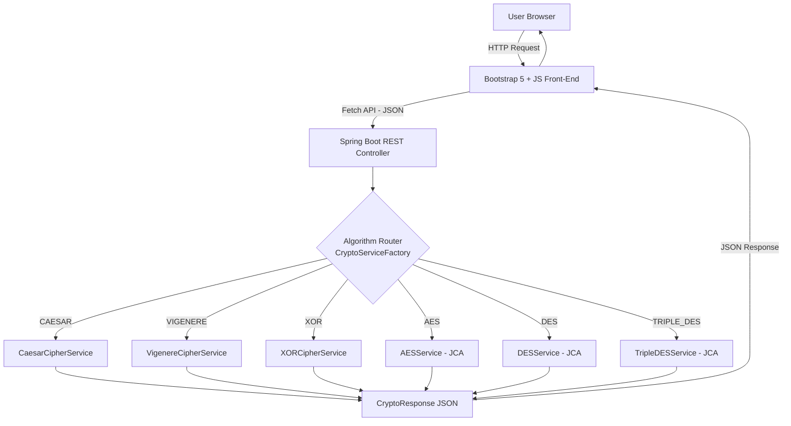
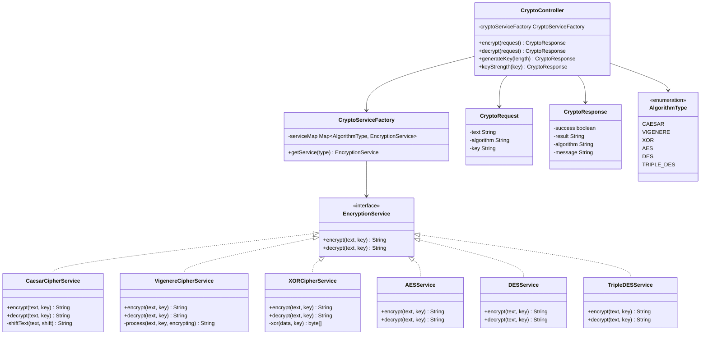
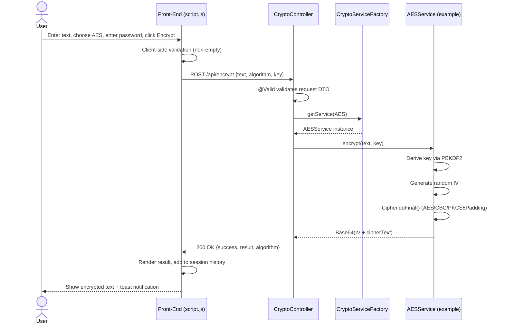
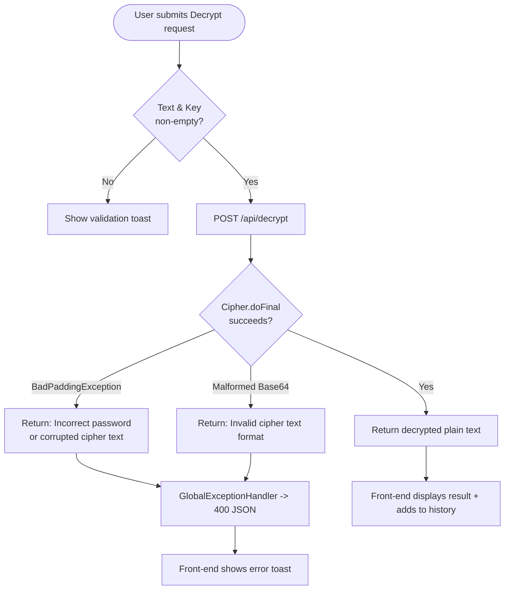

# SecureCrypt — Diagrams

## 1. System Architecture (Flowchart)

```mermaid
flowchart TD
    A[User Browser] -->|HTTP Request| B[Bootstrap 5 + JS Front-End]
    B -->|Fetch API - JSON| C[Spring Boot REST Controller]
    C --> D{Algorithm Router<br/>CryptoServiceFactory}
    D -->|CAESAR| E1[CaesarCipherService]
    D -->|VIGENERE| E2[VigenereCipherService]
    D -->|XOR| E3[XORCipherService]
    D -->|AES| E4[AESService - JCA]
    D -->|DES| E5[DESService - JCA]
    D -->|TRIPLE_DES| E6[TripleDESService - JCA]
    E1 --> F[CryptoResponse JSON]
    E2 --> F
    E3 --> F
    E4 --> F
    E5 --> F
    E6 --> F
    F -->|JSON Response| B
    B --> A
```

## 2. Class Diagram

```mermaid
classDiagram
    class EncryptionService {
        <<interface>>
        +encrypt(text, key) String
        +decrypt(text, key) String
    }

    class CaesarCipherService {
        +encrypt(text, key) String
        +decrypt(text, key) String
        -shiftText(text, shift) String
    }
    class VigenereCipherService {
        +encrypt(text, key) String
        +decrypt(text, key) String
        -process(text, key, encrypting) String
    }
    class XORCipherService {
        +encrypt(text, key) String
        +decrypt(text, key) String
        -xor(data, key) byte[]
    }
    class AESService {
        +encrypt(text, key) String
        +decrypt(text, key) String
    }
    class DESService {
        +encrypt(text, key) String
        +decrypt(text, key) String
    }
    class TripleDESService {
        +encrypt(text, key) String
        +decrypt(text, key) String
    }

    class CryptoServiceFactory {
        -serviceMap Map~AlgorithmType, EncryptionService~
        +getService(type) EncryptionService
    }

    class CryptoController {
        -cryptoServiceFactory CryptoServiceFactory
        +encrypt(request) CryptoResponse
        +decrypt(request) CryptoResponse
        +generateKey(length) CryptoResponse
        +keyStrength(key) CryptoResponse
    }

    class CryptoRequest {
        -text String
        -algorithm String
        -key String
    }
    class CryptoResponse {
        -success boolean
        -result String
        -algorithm String
        -message String
    }
    class AlgorithmType {
        <<enumeration>>
        CAESAR
        VIGENERE
        XOR
        AES
        DES
        TRIPLE_DES
    }

    EncryptionService <|.. CaesarCipherService
    EncryptionService <|.. VigenereCipherService
    EncryptionService <|.. XORCipherService
    EncryptionService <|.. AESService
    EncryptionService <|.. DESService
    EncryptionService <|.. TripleDESService

    CryptoController --> CryptoServiceFactory
    CryptoController --> CryptoRequest
    CryptoController --> CryptoResponse
    CryptoServiceFactory --> EncryptionService
    CryptoController --> AlgorithmType
```

## 3. Sequence Diagram — Encrypt Flow

```mermaid
sequenceDiagram
    actor U as User
    participant UI as Front-End (script.js)
    participant API as CryptoController
    participant FAC as CryptoServiceFactory
    participant SVC as AESService (example)

    U->>UI: Enter text, choose AES, enter password, click Encrypt
    UI->>UI: Client-side validation (non-empty)
    UI->>API: POST /api/encrypt {text, algorithm, key}
    API->>API: @Valid validates request DTO
    API->>FAC: getService(AES)
    FAC-->>API: AESService instance
    API->>SVC: encrypt(text, key)
    SVC->>SVC: Derive key via PBKDF2
    SVC->>SVC: Generate random IV
    SVC->>SVC: Cipher.doFinal() (AES/CBC/PKCS5Padding)
    SVC-->>API: Base64(IV + cipherText)
    API-->>UI: 200 OK {success, result, algorithm}
    UI->>UI: Render result, add to session history
    UI-->>U: Show encrypted text + toast notification
```

## 4. Flowchart — Decrypt Error Handling

```mermaid
flowchart TD
    Start([User submits Decrypt request]) --> V{Text & Key<br/>non-empty?}
    V -- No --> ErrToast[Show validation toast]
    V -- Yes --> Call[POST /api/decrypt]
    Call --> Try{Cipher.doFinal<br/>succeeds?}
    Try -- BadPaddingException --> WrongKey[Return: Incorrect password<br/>or corrupted cipher text]
    Try -- Malformed Base64 --> BadInput[Return: Invalid cipher text format]
    Try -- Yes --> Success[Return decrypted plain text]
    WrongKey --> ErrorResp[GlobalExceptionHandler -> 400 JSON]
    BadInput --> ErrorResp
    ErrorResp --> Toast[Front-end shows error toast]
    Success --> Show[Front-end displays result + adds to history]
```
